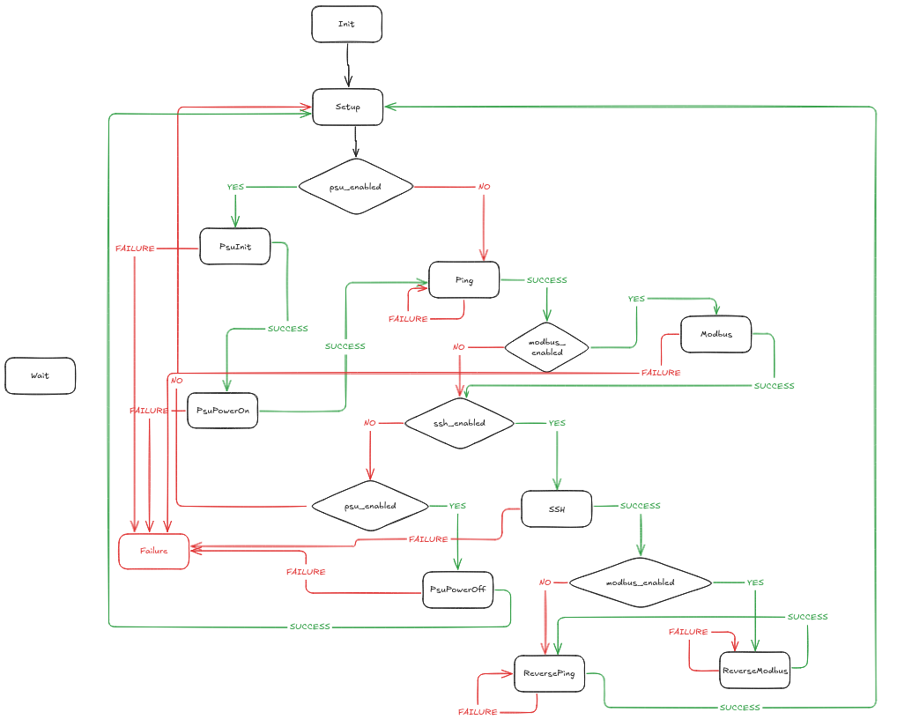

# PowerSupplyCycleTool
Power supply tool

## State machine


## Env
- Python 3.11.2

## Setup (Linux - Debian 12)
```sh
apt install python3-tk
python3 -m venv .venv
source .venv/bin/activate
pip install -r requirements.txt
```

## Run
```sh
python PowerSupplyCycleTool.py
```
