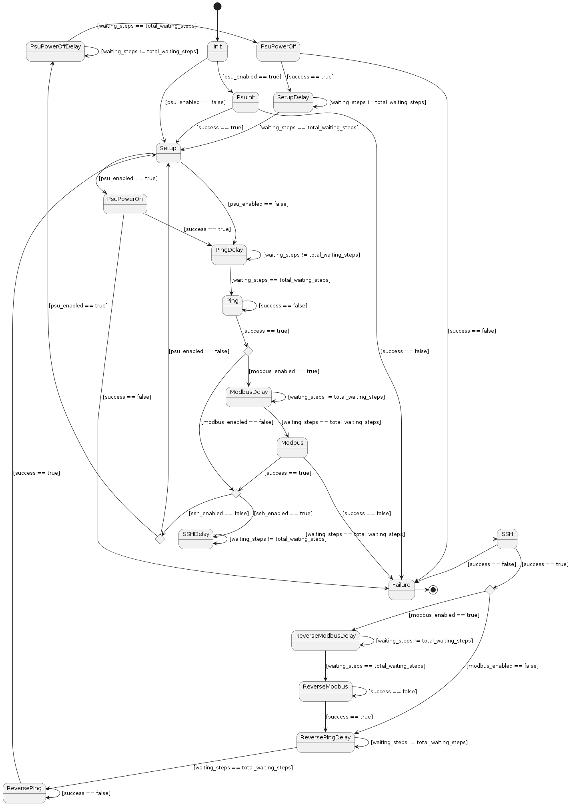

# TestbenchManager

## Description
**TestbenchManager** is a graphical tool designed to test a set of devices connected to the network using different tecniques. It is able to:

- communicate with a remote power supply unit over TCP/IP (dp832)
- send HTTP requests using [curl](https://curl.se/) to the devices under test
- run SSH commands to the devices under test
- exchange data using [MODBUS](https://en.wikipedia.org/wiki/Modbus) protocol with the devices under test

**TestbenchManager** handles the testing procedure, the GUI and the logging using python "multithreading".

## Environment
- Python 3.11.2
- Linux - Debian 12

## Setup
```sh
apt install python3-tk
python3 -m venv .venv
source .venv/bin/activate
pip install -r requirements.txt
```

## Run
```sh
python src/main.py
```

## State machine
The workflow for the testing procedure is handled using a state machine. The name of each state of the state machine reflects the type of operation that state will perform.
There are 10 main states:

- *Init*: the initial state. It checks if the remote PSU is enabled, then proceeds to initialize it or go to the *Setup* state.

**Note: the state-machine will never return to this state again.**

- *PsuInit*: initialize the PSU (connect to it and set the output voltages). If it fails, the state machine transitions to *Failure*, otherwise it transitions to *Setup*.

**Note: the state-machine will never return to this state again.**

- *Setup*: clear the GUI and update the cycle count. Then, it checks if the remote PSU is enabled and proceeds to transitions to *PsuPowerOn* state or transitions to *Ping*.

- *PsuPowerOn*: switch-on the PSU. If it fails, the state machine transitions to *Failure*, otherwise it transitions to *Ping*.

- *Ping*: perform the ping procedure, which exits succesfully only if every device under test has answered to the ping. Each device needs to answer ONLY ONCE, then it won't be pinged again. If the procedure is succesful, the state machine check if the MODBUS check is enabled. If so, it transitions to *Modbus*. Otherwise, if the SSH command is enabled, it transitions to *SSH*. Otherwise, if the PSU is enabled, it transitions to *PsuPowerOff*. Otherwise, it transitions to *Setup*. If the procedure fails, the state doesn't change.

- *SSH*: perform the SSH procedure, which exits succesfully only if none of the devices under test have raised an exception after the SSH command has been run. If so, it checks if the MODBUS check is enabled. If so, the state machine transitions to *ReverseModbus*, otherwise it transitions to *ReversePing*. If the SSH procedure fails, the state machine transitions to *Failure*.

- *Modbus*: perform the MODBUS procedure, which exits succesfully only if every device has answered with a cycle count that is equal to the current cycle count of the state machine. If so, the state machine transitions to *ReversePing*, otherwise it transitions to *Failure*.

- *PsuPowerOff*: switch-off the PSU. If it fails, the state machine transitions to *Failure*, otherwise it go to the *Setup* state.

- *ReversePing*: perform the reverse ping procedure, which exits succesfully only if no devices under test have answered to the ping. Each device, after not answering the first time, will not be pinged again. If the procedure is succesful, the state machine transitions to *Setup*, otherwise the state doesn't change.

- *ReverseModbus*: perform the reverse MODBUS procedure, which exits succesfully only if no devices have answered to the MODBUS request. If the procedure is succesful, the state machine transitions to *ReversePing*, otherwise the state doesn't change.

- *Failure*: state that signals a failure. This is the end state and will not change.

Some states are preceded by a *Delay* state, which works as a delay during the transition between two main states.



## Configuration
**TestbenchManager** provides a persistent configuration file in a JSON format, which can be edited using the GUI. The user can change different types of parameters, grouped in the following sets:
- PSU: manages the remote power supply unit
- Timing: manages the different delays/timeouts used in the state machine
- SSH: manages the SSH communication with the devices under test
- MODBUS: manages the MODBUS communication with the devices under test

### PSU
- enable the remote PSU connection
- edit the IP address of the remote PSU

### Timing
- Ping delay: the time between the start of the cycle and the ping procedure
- Intra-URL ping check: the time between two consecutive ping-checks (timeout excluded)
- Power-off post delay: the time between the end of the power-off procedure and the next test iteration
- Max. Intra-URL ping delay: the maximum time between the first device that answers to a ping and the others
- Starting cycle count: the number of cycles to start with. This parameter is mainly used to check the synchronization between the tool and the devices under test

### SSH
- enable the SSH behaviour (replaces the power-off of the PSU with an SSH command to run, in many cases it's a reboot using /sbin/reboot)
- edit the username
- edit the password
- edit the command to run

Note: the tool will try to connect to EVERY device under test using the above parameters

### MODBUS
- enable the automatic check of cycle count
- edit the register address (to read/write)
- edit the register value (to write)

## URL file
**TestbenchManager** picks the URLs to test from the *urls.csv* file, which is also editable from the GUI. Each line must contain a single URL, expect for the first line which is the header of the CSV file.

Note: DO NOT EDIT THE HEADER (the first line of the file)
